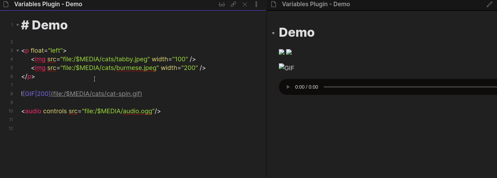

# Obsidian Variables

This plugin for [Obsidian](https://obsidian.md/) adds support for environment variables to your markdown files that get replaced with their corresponding values in Reading or Live Preview mode.

## Documentation

Check out the full documentation [here](docs.md).

## Installation

This plugin is not yet part of the community plugin list so it cannot be installed from Obsidian so it must be installed manually with the following steps:

1. Go to repo's [Releases](https://github.com/jffaust/obsidian-variables/releases) page
2. Download `main.js`, `styles.css` and `manifest.json` from the latest release
3. Move the downloaded files to a new folder inside your plugins folder: `VaultFolder/.obsidian/plugins/obsidian-variables/`

## Support

If you find this plugin useful, please consider supporting my work:

